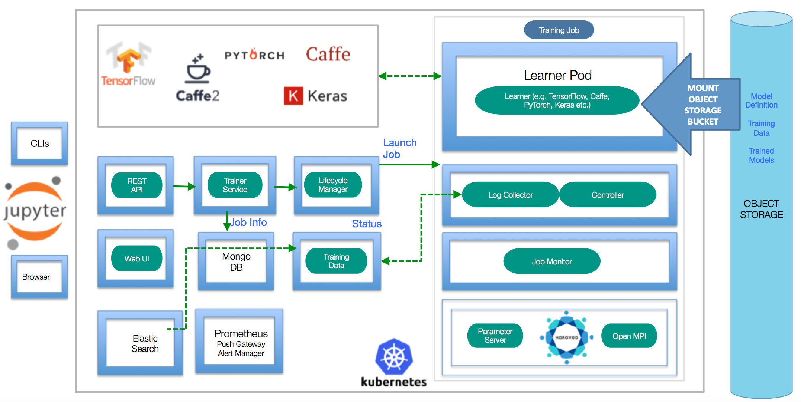
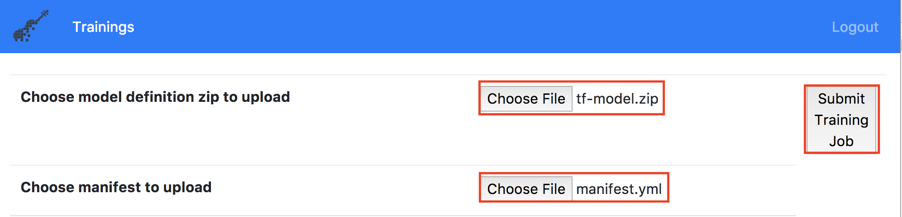

[](https://travis-ci.org/IBM/FfDL)

# Fabric for Deep Learning (FfDL)

This repository contains the core services of the *FfDL* (Fabric for Deep Learning) platform. FfDL is an operating system "fabric" for Deep Learning

FfDL is a collaboration platform for:
- Framework-independent training of Deep Learning models on distributed hardware
- Open Deep Learning APIs  
- Common instrumentation
- Running Deep Learning hosting in user's private or public cloud



## Prerequisites

* `kubectl`: The Kubernetes command line interface (https://kubernetes.io/docs/tasks/tools/install-kubectl/)

* `helm`: The Kubernetes package manager (https://helm.sh)

* `docker`: The Docker command-line interface (https://www.docker.com/)

* `S3 CLI`: The [command-line interface](https://aws.amazon.com/cli/) to configure your Object Storage

* An existing Kubernetes cluster (e.g., [Minikube](https://github.com/kubernetes/minikube) for local testing).
  For Minikube, use the command `make minikube` to start Minikube and set up local network routes. Minikube **v0.25.1** is tested with Travis CI.

* Follow the appropriate instructions for standing up your Kubernetes cluster using [IBM Cloud Public](https://github.com/IBM/container-journey-template/blob/master/README.md) or [IBM Cloud Private](https://github.com/IBM/deploy-ibm-cloud-private/blob/master/README.md)

* The minimum recommended capacity for FfDL is 4GB Memory and 2 CPUs.

## Usage Scenarios

* If you already have a FfDL deployment up and running, you can jump to [FfDL User Guide](docs/user-guide.md) to use FfDL for training your deep learning models.

* If you have FfDL confiugured to use GPUs, and want to train using GPUs, follow steps [here](docs/gpu-guide.md)

* If you have used FfDL to train your models, and want to use a GPU enabled public cloud hosted service for further training and serving, please follow instructions [here](etc/converter/ffdl-wml.md) to train and serve your models using [Watson Studio Deep Learning](https://www.ibm.com/cloud/deep-learning) service

* If you are getting started and want to setup your own FfDL deployment, please follow the steps below.

## Steps

1. [Quick Start](#1-quick-start)
  - 1.1 [Installation using Minikube](#11-installation-using-minikube)
  - 1.2 [Installation using Kubernetes Cluster](#12-installation-using-kubernetes-cluster)
  - 1.3 [Installation using IBM Cloud Kubernetes Cluster](#13-installation-using-ibm-cloud-kubernetes-cluster)
2. [Test](#2-test)
3. [Monitoring](#3-monitoring)
4. [Development](#4-development)
5. [Detailed Installation Instructions](#5-detailed-installation-instructions)
6. [Detailed Testing Instructions](#6-detailed-testing-instructions)
  - 6.1 [Using FfDL Local S3 Based Object Storage](#61-using-ffdl-local-s3-based-object-storage)
  - 6.2 [Using Cloud Object Storage](#62-using-cloud-object-storage)
7. [Clean Up](#7-clean-up)
8. [Troubleshooting](#8-troubleshooting)
9. [References](#9-references)

## 1. Quick Start

There are multiple installation paths for installing FfDL locally ("1-click-install") or into an existing Kubernetes cluster.

> Note: If your Kubernetes Cluster version is 1.7 or below, please go to the [values.yaml](values.yaml) and change `k8s_1dot8_or_above` to **false**.

### 1.1 Installation using Minikube

If you have Minikube installed on your machine, use these commands to deploy the FfDL platform:
``` shell
export VM_TYPE=minikube
make minikube
make deploy
```

### 1.2 Installation using Kubernetes Cluster

To install FfDL to a proper Kubernetes cluster, make sure `kubectl` points to the right namespace,
then deploy the platform services:
> Note: For PUBLIC_IP, put down one of your Cluster Public IP that can access your Cluster's NodePorts.

``` shell
export VM_TYPE=none
export PUBLIC_IP=<Cluster Public IP>
make deploy
```

### 1.3 Installation using IBM Cloud Kubernetes Cluster

To install FfDL to a proper IBM Cloud Kubernetes cluster, make sure `kubectl` points to the right namespace
and your machine is logged in with `bx login`, then deploy the platform services:
``` shell
export VM_TYPE=ibmcloud
export CLUSTER_NAME=<Your Cluster Name> # Replace <Your Cluster Name> with your IBM Cloud Cluster Name
make deploy
```

## 2. Test

To submit a simple example training job that is included in this repo (see `etc/examples` folder):

```
make test-submit
```

## 3. Monitoring

The platform ships with a simple Grafana monitoring dashboard. The URL is printed out when running the `deploy` make target.

## 4. Development

Please refer to the [developer guide](docs/developer-guide.md) for more details.

## 5. Detailed Installation Instructions

1. First, clone this repository and install the helm tiller on your Kubernetes cluster.
``` shell
helm init

# Make sure the tiller pod is Running before proceeding to the next step.
kubectl get pods --all-namespaces | grep tiller-deploy
# kube-system   tiller-deploy-fb8d7b69c-pcvc2              1/1       Running
```

2. Now let's install all the necessary FfDL components using helm install.
> Note: If your Kubernetes Cluster version is 1.7 or below, please go to the [values.yaml](values.yaml) and change `k8s_1dot8_or_above` to **false**.

``` shell
helm install .
```
> Note: If you want to upgrade an older version of FfDL, run
> `helm upgrade $(helm list | grep ffdl | awk '{print $1}' | head -n 1) .`

Make sure all the FfDL components are installed and running before moving to the next step.
``` shell
kubectl get pods
# NAME                                 READY     STATUS    RESTARTS   AGE
# alertmanager-7cf6b988b9-h9q6q        1/1       Running   0          5h
# etcd0                                1/1       Running   0          5h
# ffdl-lcm-65bc97bcfd-qqkfc            1/1       Running   0          5h
# ffdl-restapi-8777444f6-7jfcf         1/1       Running   0          5h
# ffdl-trainer-768d7d6b9-4k8ql         1/1       Running   0          5h
# ffdl-trainingdata-866c8f48f5-ng27z   1/1       Running   0          5h
# ffdl-ui-5bf86cc7f5-zsqv5             1/1       Running   0          5h
# mongo-0                              1/1       Running   0          5h
# prometheus-5f85fd7695-6dpt8          2/2       Running   0          5h
# pushgateway-7dd8f7c86d-gzr2g         2/2       Running   0          5h
# storage-0                            1/1       Running   0          5h

helm status $(helm list | grep ffdl | awk '{print $1}' | head -n 1) | grep STATUS:
# STATUS: DEPLOYED
```

3. Run the following script to configure Grafana for monitoring FfDL using the logging information from prometheus.
> Note: If you are using a IBM Cloud Cluster, make sure you are logged in with `bx login`.

``` shell
# If your Cluster is running on Minikube, replace "ibmcloud" to "minikube"
# If your Cluster is not running on Minikube or IBM Cloud, replace "ibmcloud" to "none"
export VM_TYPE=ibmcloud

# Replace <Your Cluster Name> with your IBM Cloud Cluster Name if your cluster is on IBM Cloud.
# Use export PUBLIC_IP if you are using a none VM_TYPE. A Cluster Public IP that can access your Cluster's NodePorts.
export CLUSTER_NAME=<Your Cluster Name>
export PUBLIC_IP=<Cluster Public IP>

./bin/grafana.init.sh
```

4. Lastly, run the following commands to obtain your Grafana, FfDL Web UI, and FfDL restapi endpoints.
``` shell
# Note: $(make --no-print-directory kubernetes-ip) simply gets the Public IP for your cluster.
node_ip=$(make --no-print-directory kubernetes-ip)

# Obtain all the necessary NodePorts for Grafana, Web UI, and RestAPI.
grafana_port=$(kubectl get service grafana -o jsonpath='{.spec.ports[0].nodePort}')
ui_port=$(kubectl get service ffdl-ui -o jsonpath='{.spec.ports[0].nodePort}')
restapi_port=$(kubectl get service ffdl-restapi -o jsonpath='{.spec.ports[0].nodePort}')

# Echo statements to print out Grafana and Web UI URLs.
echo "Monitoring dashboard: http://$node_ip:$grafana_port/ (login: admin/admin)"
echo "Web UI: http://$node_ip:$ui_port/#/login?endpoint=$node_ip:$restapi_port&username=test-user"
```

Congratulation, FfDL is now running on your Cluster. Now you can go to [Step 6](#6-detailed-testing-instructions) to run some sample jobs or go to the [user guide](docs/user-guide.md) to learn about how to run and deploy your custom models.

## 6. Detailed Testing Instructions

In this example, we will run some simple jobs to train a convolutional network model using TensorFlow and Caffe. We will download a set of
MNIST handwritten digit images, store them with Object Storage, and use the FfDL CLI to train a handwritten digit classification model.

> Note: For Minikube, make sure you have the latest TensorFlow Docker image by running `docker pull tensorflow/tensorflow`

### 6.1. Using FfDL Local S3 Based Object Storage

1. Run the following commands to obtain the object storage endpoint from your cluster.
```shell
node_ip=$(make --no-print-directory kubernetes-ip)
s3_port=$(kubectl get service s3 -o jsonpath='{.spec.ports[0].nodePort}')
s3_url=http://$node_ip:$s3_port
```

2. Next, set up the default object storage access ID and KEY. Then create buckets for all the necessary training data and models.
```shell
export AWS_ACCESS_KEY_ID=test; export AWS_SECRET_ACCESS_KEY=test; export AWS_DEFAULT_REGION=us-east-1;

s3cmd="aws --endpoint-url=$s3_url s3"
$s3cmd mb s3://tf_training_data
$s3cmd mb s3://tf_trained_model
$s3cmd mb s3://mnist_lmdb_data
$s3cmd mb s3://dlaas-trained-models
```

3. Now, create a temporary repository, download the necessary images for training and labeling our TensorFlow model, and upload those images
to your tf_training_data bucket.

```shell
mkdir tmp
for file in t10k-images-idx3-ubyte.gz t10k-labels-idx1-ubyte.gz train-images-idx3-ubyte.gz train-labels-idx1-ubyte.gz;
do
  test -e tmp/$file || wget -q -O tmp/$file http://yann.lecun.com/exdb/mnist/$file
  $s3cmd cp tmp/$file s3://tf_training_data/$file
done
```

4. Next, let's download all the necessary training and testing images in [LMDB format](https://en.wikipedia.org/wiki/Lightning_Memory-Mapped_Database) for our Caffe model
and upload those images to your mnist_lmdb_data bucket.

```shell
for phase in train test;
do
  for file in data.mdb lock.mdb;
  do
    tmpfile=tmp/$phase.$file
    test -e $tmpfile || wget -q -O $tmpfile https://github.com/albarji/caffe-demos/raw/master/mnist/mnist_"$phase"_lmdb/$file
    $s3cmd cp $tmpfile s3://mnist_lmdb_data/$phase/$file
  done
done
```

5. Now you should have all the necessary training data set in your object storage. Let's go ahead to set up your restapi endpoint
and default credentials for Deep Learning as a Service. Once you done that, you can start running jobs using the FfDL CLI (executable
binary).

```shell
restapi_port=$(kubectl get service ffdl-restapi -o jsonpath='{.spec.ports[0].nodePort}')
export DLAAS_URL=http://$node_ip:$restapi_port; export DLAAS_USERNAME=test-user; export DLAAS_PASSWORD=test;

# Obtain the correct CLI for your machine and run the training job with our default TensorFlow model
CLI_CMD=cli/bin/ffdl-$(if [ "$(uname)" = "Darwin" ]; then echo 'osx'; else echo 'linux'; fi)
$CLI_CMD train etc/examples/tf-model/manifest.yml etc/examples/tf-model
```

Congratulations, you had submitted your first job on FfDL. You can check your FfDL status either from the FfDL UI or simply run `$CLI_CMD list`

> You can learn about how to create your own model definition files and `manifest.yaml` at [user guild](docs/user-guide.md#2-create-new-models-with-ffdl).

6. Since it's simple and straightforward to submit jobs with different deep learning framework on FfDL, let's try to run a Caffe Job.

```shell
$CLI_CMD train etc/examples/caffe-model/manifest.yml etc/examples/caffe-model
```

Congratulation, now you know how to deploy jobs with different deep learning framework. To learn more about your job execution results,
you can simply run `$CLI_CMD logs <MODEL_ID>`

> If you no longer need any of the MNIST dataset we used in this example, you can simply delete the `tmp` repository.

7. If you want to run your job via the FfDL UI, simply run the below command to create your model zip file.

```shell
# Replace tf-model with the model you want to zip
pushd etc/examples/tf-model && zip ../tf-model.zip * && popd
```

Then, upload `tf-model.zip` and `manifest.yml` (The default TensorFlow model) in the `etc/examples/` repository as shown below.
Then, click `Submit Training Job` to run your job.



### 6.2. Using Cloud Object Storage

In this section we will demonstrate how to run a TensorFlow job with training data stored in Cloud Object Storage.

> Note: This also can be done with other Cloud providers' Object Storage, but we will demonstrate how to use IBM Cloud Object Storage in this instructions.

1. Provision an S3 based Object Storage from your Cloud provider. Take note of your Authentication Endpoints, Access Key ID and Secret.

> For IBM Cloud, you can provision an Object Storage from [IBM Cloud Dashboard](https://console.bluemix.net/catalog/infrastructure/cloud-object-storage?taxonomyNavigation=apps) or from [SoftLayer Portal](https://control.softlayer.com/storage/objectstorage).

2. Setup your S3 command with the Object Storage credentials you just obtained.

```shell
s3_url=http://<Your object storage Authentication Endpoints>
export AWS_ACCESS_KEY_ID=<Your object storage Access Key ID>
export AWS_SECRET_ACCESS_KEY=<Your object storage Access Key Secret>

s3cmd="aws --endpoint-url=$s3_url s3"
```

3. Next, let us create 2 buckets, one for storing the training data and another one for storing the training result.
```shell
trainingDataBucket=<unique bucket name for training data storage>
trainingResultBucket=<unique bucket name for training result storage>

$s3cmd mb s3://$trainingDataBucket
$s3cmd mb s3://$trainingResultBucket
```

4. Now, create a temporary repository, download the necessary images for training and labeling our TensorFlow model, and upload those images to your training data bucket.

```shell
mkdir tmp
for file in t10k-images-idx3-ubyte.gz t10k-labels-idx1-ubyte.gz train-images-idx3-ubyte.gz train-labels-idx1-ubyte.gz;
do
  test -e tmp/$file || wget -q -O tmp/$file http://yann.lecun.com/exdb/mnist/$file
  $s3cmd cp tmp/$file s3://$trainingDataBucket/$file
done
```

5. Next, we need to modify our example job to use your Cloud Object Storage using the following sed commands.
```shell
if [ "$(uname)" = "Darwin" ]; then
  sed -i '' s#"tf_training_data"#"$trainingDataBucket"# etc/examples/tf-model/manifest.yml
  sed -i '' s#"tf_trained_model"#"$trainingResultBucket"# etc/examples/tf-model/manifest.yml
  sed -i '' s#"http://s3.default.svc.cluster.local"#"$s3_url"# etc/examples/tf-model/manifest.yml
  sed -i '' s#"user_name: test"#"user_name: $AWS_ACCESS_KEY_ID"# etc/examples/tf-model/manifest.yml
  sed -i '' s#"password: test"#"password: $AWS_SECRET_ACCESS_KEY"# etc/examples/tf-model/manifest.yml
else
  sed -i s#"tf_training_data"#"$trainingDataBucket"# etc/examples/tf-model/manifest.yml
  sed -i s#"tf_trained_model"#"$trainingResultBucket"# etc/examples/tf-model/manifest.yml
  sed -i s#"http://s3.default.svc.cluster.local"#"$s3_url"# etc/examples/tf-model/manifest.yml
  sed -i s#"user_name: test"#"user_name: $AWS_ACCESS_KEY_ID"# etc/examples/tf-model/manifest.yml
  sed -i s#"password: test"#"password: $AWS_SECRET_ACCESS_KEY"# etc/examples/tf-model/manifest.yml
fi
```

6. Now you should have all the necessary training data set in your training data bucket. Let's go ahead to set up your restapi endpoint
and default credentials for Deep Learning as a Service. Once you done that, you can start running jobs using the FfDL CLI (executable
binary).

```shell
restapi_port=$(kubectl get service ffdl-restapi -o jsonpath='{.spec.ports[0].nodePort}')
export DLAAS_URL=http://$node_ip:$restapi_port; export DLAAS_USERNAME=test-user; export DLAAS_PASSWORD=test;

# Obtain the correct CLI for your machine and run the training job with our default TensorFlow model
CLI_CMD=cli/bin/ffdl-$(if [ "$(uname)" = "Darwin" ]; then echo 'osx'; else echo 'linux'; fi)
$CLI_CMD train etc/examples/tf-model/manifest.yml etc/examples/tf-model
```

## 7. Clean Up
If you want to remove FfDL from your cluster, simply use the command below or run `helm delete <your FfDL release name>`
```shell
helm delete $(helm list | grep ffdl | awk '{print $1}' | head -n 1)
```

## 8. Troubleshooting

* FfDL has only been tested under Mac OS and Linux

* The default Minikube driver under Mac OS is VirtualBox, which is known for having issues with networking.
  We generally recommend Mac OS users to install Minikube using the xhyve driver.

* Also, when testing locally with Minikube, make sure to point the `docker` CLI to Minikube's Docker daemon:

   ```
   eval $(minikube docker-env)
   ```
* If you run into DNS name resolution issues using Minikube, make sure that the system uses only `10.0.0.10`
  as the single nameserver. Using multiple nameservers can result in problems, in particular under Mac OS.

* If `glide install` fails with an error complaining about non-existing paths (e.g., "Without src, cannot continue"),
  make sure to follow the standard Go directory layout (see [Prerequisites section]{#Prerequisites}).

* To remove FfDL on your Cluster, simply run `make undeploy`

## 9. References

Based on IBM Research work in Deep Learning.

* B. Bhattacharjee et al., "IBM Deep Learning Service," in IBM Journal of Research and Development, vol. 61, no. 4, pp. 10:1-10:11, July-Sept. 1 2017.   https://arxiv.org/abs/1709.05871

* Scott Boag, et al. Scalable Multi-Framework Multi-Tenant Lifecycle Management of Deep Learning Training Jobs, In Workshop on ML Systems at NIPS'17, 2017. http://learningsys.org/nips17/assets/papers/paper_29.pdf
