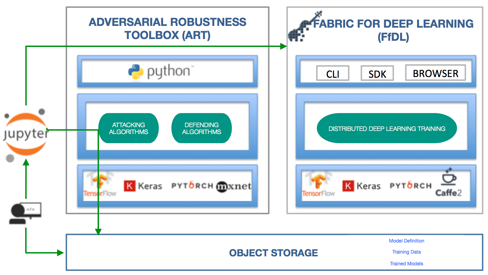
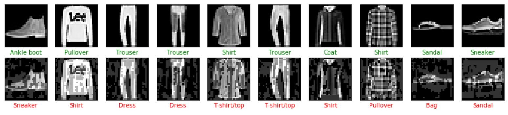

# Jupyter Notebook using FfDL with Adversarial Robustness Toolbox to test the robustness of Deep Learning Models

The [Adversarial Robustness Toolbox (ART)](https://github.com/IBM/adversarial-robustness-toolbox), an open source software library, supports both researchers and developers in defending deep neural networks against adversarial attacks, making AI systems more secure. Its purpose is to allow rapid crafting and analysis of attack and defense methods for machine learning models.

[Fabric for Deep Learning (FfDL, pronounced “fiddle”)](https://github.com/IBM/FfDL) provides a consistent way to run deep-learning frameworks such as TensorFlow, PyTorch, Caffe, Keras etc. as a service on Kubernetes.

This [Jupyter](http://jupyter.org/install) notebook trains a [Fashion MNIST](#dataset) model with 
[Fabric for Deep Learning (FfDL)](https://github.com/IBM/FfDL) on a Kubernetes Cluster and uses the 
[Adversarial Robustness Toolbox (ART)](https://github.com/IBM/adversarial-robustness-toolbox) to generate adversarial 
samples and test the robustness of the model against adversarial attacks.



The [notebook](ART_with_FfDL.ipynb) is structured into sections which can be run as a whole or in individual pieces like
the model training or adversarial attacks on a trained model.

## Notebook Contents

1. **Set up the environment** - Configure access to FfDL cluster, to cloud object storage. Upload the training data to 
   cloud object storage.
   
2. **Create a Keras model** - Create a Convolutional Neural Network (CNN) training script based on 
   [keras/examples/mnist_cnn.py](https://github.com/keras-team/keras/blob/master/examples/mnist_cnn.py) and upload it to
   cloud object storage. Create a FfDL `manifest.yml` to describing the model, the deep learning framework, the object 
   store information, resource requirements, and hyperparameters required for training and testing.
   
3. **Train the model** - Setup the FfDL command line environment, start the training job with FfDL on your Kubernetes
   cluster. While the training job is running you can monitor the training logs, or, optionally cancel the training job.
   
4. **Generate adversarial samples for a robustness check** - Once the training job is completed, download the generated
   model artifacts and load the model in the notebook. Use one of ART's attack methods, the Fast Gradient Method (FGM),
   to craft adversarial samples which can be used to measure the model's robustness against adversarial attacks. Show
   robustness metrics and compare model predictions on adversarial samples to predictions on the original test images.
   
   
   
5. **Summary and next steps** - This notebook showed how to use Jupyter notebooks to interact with a FfDL cluster and 
   how the Adversarial Robustness Toolbox can be integrated into a deep learning pipeline. To learn more about ART go to
   https://github.com/IBM/adversarial-robustness-toolbox

Follow the [Prerequisites](#prerequisites) and the [Setup](#setup) steps below before [Running the Notebook](#running-the-notebook).


## Prerequisites

### Kubernetes Cluster with FfDL
You need to have [Fabric for Deep Learning](https://github.com/IBM/FfDL/) deployed on a Kubernetes Cluster with at least 
2 CPUs and 4 Gb Memory.

### Cloud Object Storage
To store model and training data, this notebook requires access to a Cloud Object Storage (COS) instance.
[BlueMix Cloud Object Storage](https://console.bluemix.net/catalog/services/cloud-object-storage) offers a free 
*lite plan*. 
Follow [these instructions](https://dataplatform.ibm.com/docs/content/analyze-data/ml_dlaas_object_store.html)
to create your COS instance and generate [service credentials](https://console.bluemix.net/docs/services/cloud-object-storage/iam/service-credentials.html#service-credentials)
with [HMAC keys](https://console.bluemix.net/docs/services/cloud-object-storage/hmac/credentials.html#using-hmac-credentials).
Then go to the COS dashboard:
- Get the `cos_service_endpoint` from the **Endpoint** tab
- In the **Service credentials** tab, click **New Credential +** 
  - Add the "[HMAC](https://console.bluemix.net/docs/services/cloud-object-storage/hmac/credentials.html#using-hmac-credentials)"
    **inline configuration parameter**: `{"HMAC":true}`, click **Add**
  - Get the `access_key_id` (*AWS_ACCESS_KEY_ID*) and `secret_access_key` (*AWS_SECRET_ACCESS_KEY*) 
    from the `cos_hmac_keys` section of the instance credentials:
    ```
      "cos_hmac_keys": {
          "access_key_id": "1234567890abcdefghijklmnopqrtsuv",
          "secret_access_key": "0987654321zxywvutsrqponmlkjihgfedcba1234567890ab"
       }
    ```


## Setup

### Environment Variables

```bash
export FFDL_DIR=""              # Path to local clone of FfDL repository
export CLUSTER_NAME=""          # Name of Kubernetes cluster with FfDL deployed
export VM_TYPE=""               # Type of VM your Kubernetes cluster is deployed on ['none'|'minikube'|'ibmcloud']
export AWS_ACCESS_KEY_ID=""     # Cloud Object Storage (AWS) Access Key ID
export AWS_SECRET_ACCESS_KEY="" # Cloud Object Storage (AWS) Secret Access Key
export AWS_DEFAULT_REGION=""    # Cloud Object Storage region name, i.e. 'us-east-1'
export AWS_ENDPOINT_URL=""      # Cloud Object Storage endpoint, i.e. 'https://s3-api.us-geo.objectstorage.softlayer.net'
```

### Virtual Environment

Before running this notebook for the first time we recommend creating a Python 3 *virtual environment* using either
[virtualenv](https://pypi.org/project/virtualenv/), [venv](https://docs.python.org/3/library/venv.html) (since Python 3.3),
or [Conda](https://conda.io/docs/user-guide/tasks/manage-environments.html).
```bash
pip3 install virtualenv
virtualenv .venv/ffdl_art
.venv/ffdl_art/bin/pip install -r requirements.txt --upgrade
```

## Running the Notebook

Activate the Python virtual environment
```bash
source .venv/ffdl_art/bin/activate
```

Start the Jupyter notebook server
```bash
jupyter-notebook
# ... use Control-C to stop the notebook server
```

Deactivate the virtual environment after stopping the Jupyter notebook server
```bash
deactivate
```

To delete the Python virtual environment run the following command
```bash
rm -rf .venv/ffdl_art
```


## Dataset

Fashion-MNIST is a [dataset of clothing images](https://github.com/zalandoresearch/fashion-mnist) provided by 
[Zalando Research](https://research.zalando.com/). It is intended to serve as a direct drop-in replacement for the 
original MNIST dataset of hand-written digits for benchmarking Machine Learning algorithms. The Fashion-MNIST dataset 
is split into 60,000 training examples and 10,000 test examples. Each example is a 28x28 grayscale image, associated 
with a label from 10 classes.


## Acknowledgements

Special thanks to [Anupama-Murthi](https://github.ibm.com/Anupama-Murthi) and [Vijay Arya](https://github.ibm.com/vijay-arya)
who created the original notebook which we modified here to showcase how to use *ART* with *FfDL*.
If you would like to try *[Watson Machine Learning (WML) Service](https://console.bluemix.net/catalog/services/machine-learning)* 
with *ART* check out Anupama and Vijay's notebook here:

[https://github.ibm.com/robust-dlaas/ART-in-WML/Use ART to check robustness of deep learning models.ipynb](https://github.ibm.com/robust-dlaas/ART-in-WML/blob/master/Use%20ART%20to%20check%20robustness%20of%20deep%20learning%20models.ipynb)


## License
[Apache 2.0](LICENSE)
