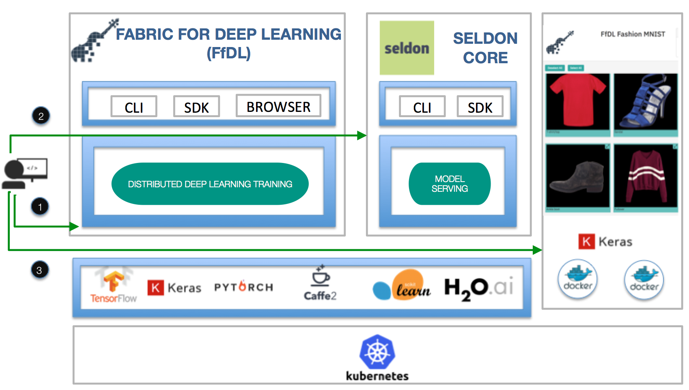
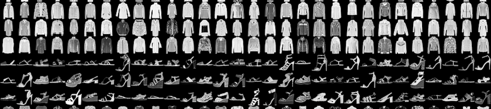

# Fashion MNIST using FfDL

Train your Fashion MNIST model with [Fabric for Deep Learning (FfDL)](https://github.com/IBM/FfDL) on Kubernetes Cluster configured with GPU. This model is defined in Keras and trained using TensorFlow using Fabric for Deep Learning which is deployed on Kubernetes GPU cluster running on IBM Cloud.

On the open source side, to complete the FfDL trained model deployment story we’ve worked together with [Seldon](https://github.com/SeldonIO/seldon-core) to provide a FfDL integration.

In this code, we will show end to end example how to train, deploy, and write an application to consume to deployed model on Fashion MNISH dataset on Kubernetes

## Prerequisites
You need to have [Fabric for Deep Learning](https://github.com/IBM/FfDL) deployed on a Kubernetes Cluster with at least 4 CPUs and 8Gb Memory.

## Steps
1. [Train your Fashion MNIST model with FfDL](fashion-train)
2. [Deploy your Fashion MNIST model with Seldon](seldon-deployment)
3. [Build the FfDL Fashion MNIST Web App and push it on Kubernetes](fashion-mnist-webapp)

## Dataset
Fashion-MNIST is a [dataset provided by Zalando of clothing images](https://github.com/zalandoresearch/fashion-mnist). It is intended to serve as a direct drop-in replacement for the original MNIST dataset for benchmarking ML algorithms. It shares the same image size and structure of training and testing splits, consisting of a training set of 60,000 examples and a test set of 10,000 examples. Each example is a 28x28 grayscale image, associated with a label from 10 classes

## Appropriate Test Data

The model will expect to receive a file path to a picture. Over 30 different file types are supported although only the two (.png and .jpg) have been tested extensively. These file types are listed at (http://pillow.readthedocs.io/en/5.1.x/handbook/image-file-formats.html)

The models trained on the Fashion MNIST data will work best when there is only one object in the picture and the background of the picture is pure black. Additionally, the object in the picture should be centered and completely in frame. Any image the model receives will be compressed into a 28x28 grayscaled image to match the original Fashion MNIST training set. Due to this, the model works best when the object in the picture takes up a majority of the frame.

## License

[Apache 2.0](LICENSE)
