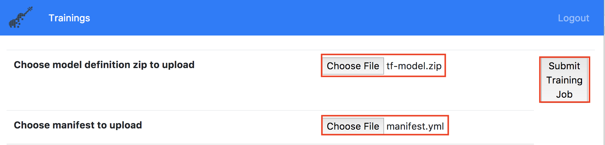

# DEMO FLOW

## Prerequisites
This demo assumes the Kubernetes Cluster has FfDL, Seldon, and Webapp built and deployed, and you have access to that cluster.

## Steps
1. Go to the FfDL GUI. You can obtain your FfDL GUI in the FfDL repository by running `make status`.

2. Submit a training job using either the FfDL GUI or command line. The model definition file is at `fashion-train/fashion-training.zip` and the manifest is at `fashion-train/manifest.yml`

   **GUI instructions**

   Upload your model definition file and manifest file. Then click **Submit Training Job**
   
   

   **Command line instructions**
   ```shell
   # Setup commands
   git clone https://github.com/IBM/Fashion-MNIST-using-FfDL
   cd FfDL-Fashion-MNIST/fashion-train
   export node_ip=<Cluster Public IP>
   export restapi_port=$(kubectl get service ffdl-restapi -o jsonpath='{.spec.ports[0].nodePort}')
   export DLAAS_URL=http://$node_ip:$restapi_port; export DLAAS_USERNAME=test-user; export DLAAS_PASSWORD=test;
   CLI_CMD=<path to FfDL repo>/cli/bin/ffdl-$(if [ "$(uname)" = "Darwin" ]; then echo 'osx'; else echo 'linux'; fi)
   ```

   ```shell
   # training command
   $CLI_CMD train manifest.yml fashion-training
   ```

3. Then the job will start running, with k80 usually takes 5 minutes. Meanwhile, we can talk about how FfDL can take advantage of GPU resources.
    * Explain some background about this training job:
      * The dataset we are using is Fashion-MNIST. It has a training set of 60,000 examples and a test set of 10,000 examples.
      * This is a CNN model with 3 Convolutional layers followed by 2 dense layers.
      * This job will run for 30 epochs and our batch size is 128.
      * The validated accuracy rate and loss rate may look strange because our model is using the Adam optimizer with 0.4 dropout rate. The great thing about FfDL is it will plot out these Scalar graphs for you, so you can use it to tell your model may have some issues.
    * Click on the info icon for the `Fashion-MNIST keras model with k80 GPU` and `Fashion-MNIST keras model with 30 CPU` respectively. Then, show k80 GPU can train this job within 5 minutes, while with pure CPU it will cost more than 9 minutes even with 30 CPUs.
    * After the training job is finished, your model will be stored in the Cloud Object Storage and ready to be served.

4. We use Seldon to serve our model that are stored in the Cloud Object Storage.

5. Use the Sample Web-app at http://<Webapp_Load_Balancer_IP>:8088 to demo your ML Web-app.
   * The demo works the best if you use fashion images with black background.
   * Sample demo images are avaliable at the `sample-test-data` directory. These images are not part of the default images on the demo website.
   * If you want to delete all your uploaded images, go to http://<Webapp_Load_Balancer_IP>:8088/cleanup and click **Delete User Uploaded Image**. Then click the FfDL icon to return to the main demo page.
