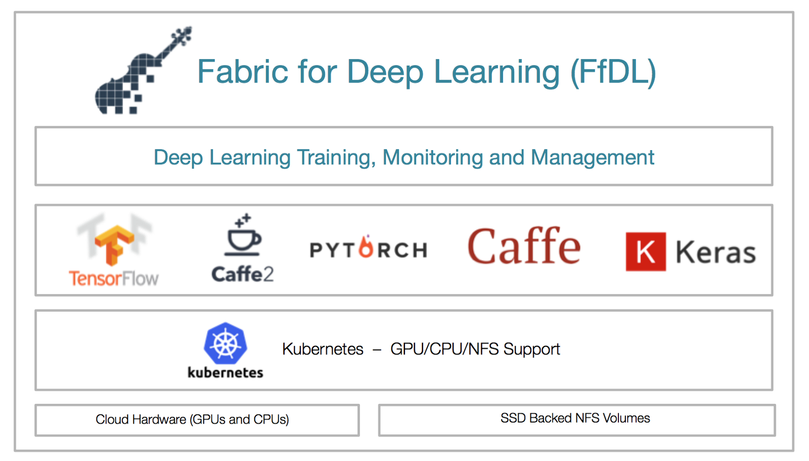

# FfDL Design Considerations

Training deep neural network models requires a highly tuned system with the right combination of software, drivers, compute, memory, network, and storage resources. To address the challenges around obtaining and managing these resources, we are happy to announce the launch of Fabric for Deep Learning (FfDL).

FfDL offers a stack that abstracts away these concerns so data scientists can execute training jobs with their choice of deep learning framework at scale in the cloud. It has been built to offer resilience, scalability, multi-tenancy, and security without modifying the deep learning frameworks, and with no or minimal changes to model code.

## FfDL architecture
The FfDL platform uses a microservices architecture, with a focus on scalability, resiliency, and fault tolerance. According to one IDC survey, by 2021 enterprise apps will shift toward hyper-agile architectures, with 80% of application development on cloud platforms using microservices and functions, and over 95% of new microservices deployed in containers. And what better cloud native platform to build on than Kubernetes? The FfDL control plane microservices are deployed as pods, and we rely on Kubernetes to manage this cluster of GPU- and CPU-enabled machines effectively, to restart microservices when they crash, and to report the health of microservices.

### REST API
The REST API microservice handles REST-level HTTP requests and acts as proxy to the lower-level gRPC Trainer service. The service also load-balances requests and is responsible for authentication. Load balancing is implemented by registering the REST API service instances dynamically in a service registry. The interface is specified through a Swagger definition file.

### Trainer
The Trainer service admits training job requests, persisting metadata and model input configuration in a database (MongoDB). It initiates job deployment, halting, and (user-requested) job termination by calling the appropriate gRPC methods on the Lifecycle Manager microservice. The Trainer also assigns a unique identifier to each job, which is used by all other components to track the job.

### Lifecycle Manager and learner pods
The Lifecycle Manager (LCM) deploys training jobs arriving from the Trainer, halting (pausing) and terminating training jobs. LCM uses the Kubernetes cluster manager to deploy containerized training jobs. A training job is a set of interconnected Kubernetes pods, each containing one or more Docker containers.

The LCM determines the learner pods, parameter servers, and interconnections among them based on the job configuration, and calls on Kubernetes for deployment. For example, if a user creates a Caffe2 training job with four learners and two CPUs/GPUs per learner, the LCM creates five pods: one for each learner (called the learner pod), and one monitoring pod called the job monitor.

### Training Data Service
The Training Data Service (TDS) provides short-lived storage and retrieval for logs and evaluation data from a Deep Learning training job. As the training job progresses, information is needed for evaluation of the ongoing success or failure of the learning progress. These metrics normally come in the form of scalar values, and are termed evaluation metrics (or sometimes the term emetrics might be used). Debugging information can also be output through log lines.

While the learning job is running, a process runs as a sidecar to extract the training data from the learner, and then pushes that data into the TDS, which pushes the data into ElasticSearch. The sidecars used for collecting training data are termed log-collectors. Depending on the framework and desired extraction method, different types of log-collectors can be used. Log-collectors are somewhat misnamed, since their responsibilities include at least both log line collection, and evaluation metrics extraction.

## FfDL forms the core of Watson Studio Deep Learning Service
FfDL, developed in close collaboration with IBM Research and Watson product development teams, forms the core of our newly announced Deep Learning as a Service within Watson Studio. Watson Studio provides tools for supporting the end-to-end AI workflow in a public cloud hosted environment, with best of the breed support for GPU resources on a Kubernetes environment