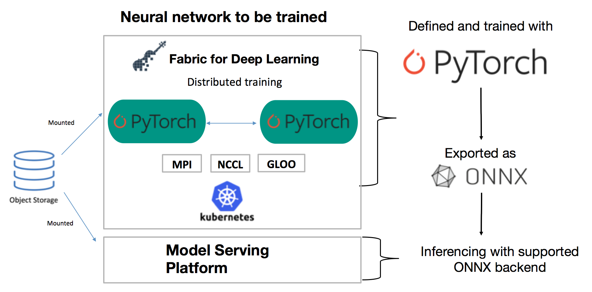

PyTorch is a key part of the IBM open source and product offerings. IBM has contributors supporting the open source PyTorch codebase, and we are adding multi-architecture support in PyTorch by enabling builds for Power architecture. There are other interesting projects that came out of IBM Research like Large Model Support and an [open source framework for seq2seq models](https://github.com/IBM/pytorch-seq2seq) in PyTorch.

Fabric for Deep Learning supports distributed deep learning training capability found in PyTorch 1.0. FfDL can provision the requested number of nodes and GPUs with a shared file system on Kubernetes that lets each node easily initialize and synchronize with the collective process group. From there, users can update gradients with various point-to-point, collective, or multi-GPU collective communication. 

## Distributed training leveraging PyTorch 1.0

Fabric for Deep Learning (FfDL) now supports both PyTorch 1.0 and the ONNX model format. We also provide several examples to demonstrate how to get started with defining the PyTorch process group with different types of communication back ends, then train the model with distributed data parallelism.

We've fully tested FfDL with the new PyTorch distributed training mechanisms using GLOO, NCCL, and MPI communication back ends to sync the model parameters.

|     | GLOO | MPI | NCCL |
|-----|:----:|:---:|:----:|
| CPU |   &#10004;  |  &#10004;  |   x  |
| GPU |   &#10004;  |  &#10004;  |   &#10004;  |

PyTorch 1.0 tested examples have been added. Following are PyTorch 1.0 distributed examples with 

-  [NCCL communication backend](c10d-native-parallelism)
-  [MPI communication backend](c10d-mpi-parallelism)
-  [GLOO communication backend](c10d-dist-onnx)

In addition, we also support [PyTorch 0.41 distributed training leveraging Uber's Horovod mechanism](https://developer.ibm.com/code/2018/07/18/scalable-distributed-training-using-horovod-in-ffdl/).

- [PyTorch distributed with Horovod](horovod)

## Tech Preview for ONNX

FfDL also has added a tech preview for [ONNX](https://github.com/onnx/onnx) integration, which is a key feature of PyTorch 1.0. 

To save the models in ONNX format, you can run your usual model training functions to train the model and save the model using the native torch.onnx function similar to saving a PyTorch model. This removed the abstractions between converting within the different training and serving frameworks you have in your organization. After you have your model converted to ONNX, you can simply load it to any serving back end and start using the model.

- [Trained with GLOO backend and exported in ONNX](c10d-dist-onnx)
- [Trained with MPI backend and exported in ONNX](c10d-onnx-mpi)

## Complete the pipeline: Deploy your ONNX-based models using Seldon with Intel nGraph

To complete the pipeline, Fabric for Deep Learning has integration with [Seldon](https://www.seldon.io/). Apart from serving PyTorch and TensorFlow models, Seldon recently announced the ability to serve ONNX models with an [Intel's  nGraph back end](https://github.com/NervanaSystems/ngraph), designed to optimize the inferencing performance, using CPUs.

- [Deploy ONNX models with Seldon and Intel nGraph](../community/FfDL-Seldon/onnx-model) 

With this, we can craft an end-to-end pipeline to convert FfDL-trained models to ONNX and serve it with Seldon. Furthermore, because FfDL can save trained models to Object Storage using the Flex volume on Kubernetes, we have improved the integration with Seldon as well to load the saved model directly from the FLEX volume, which can save the serving image disk space, generalize model wrapper definition, and improve scalability.
